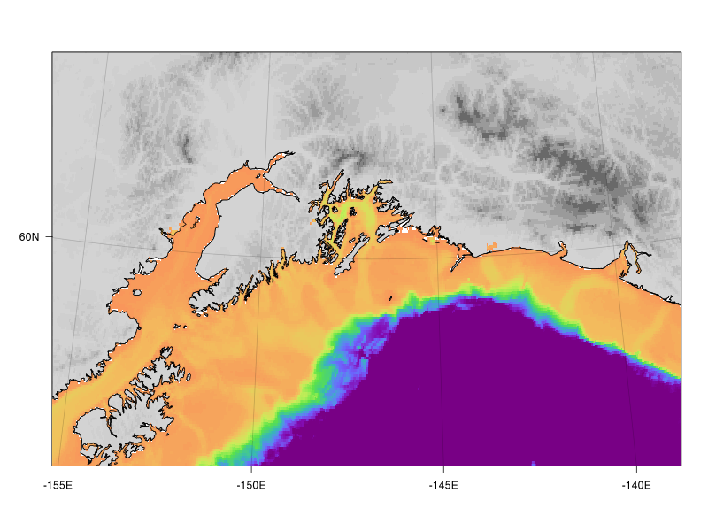
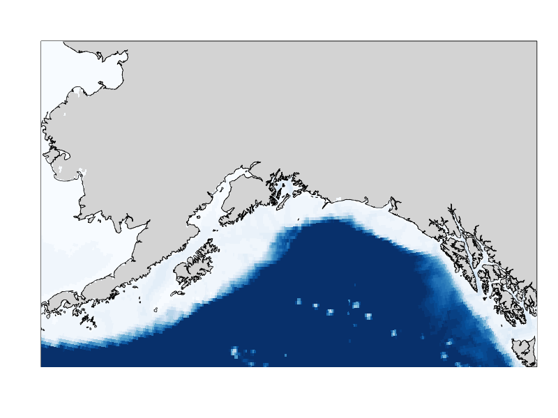
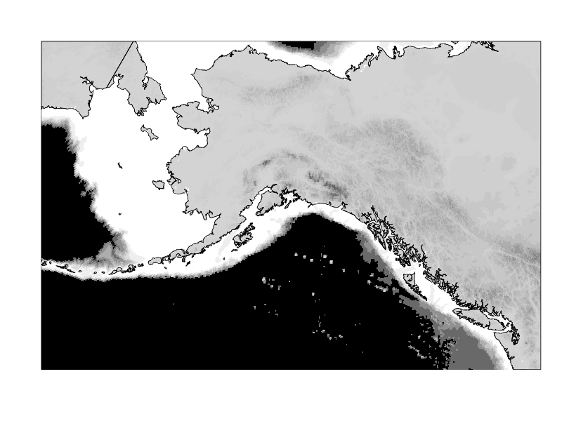
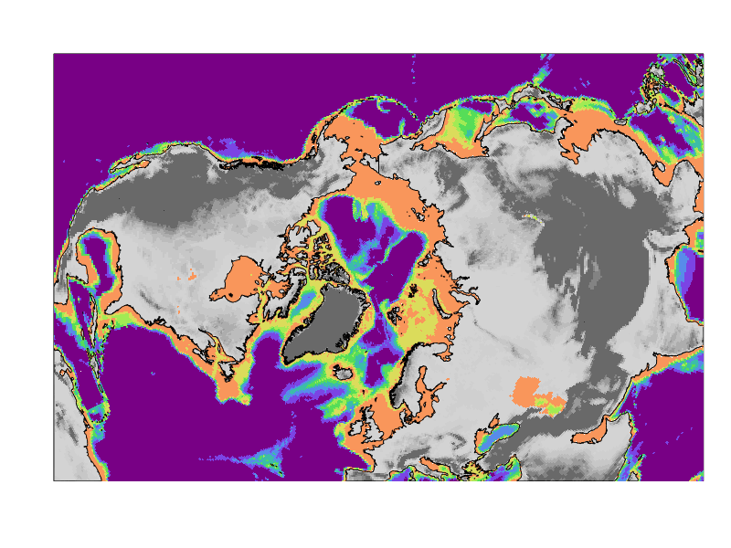
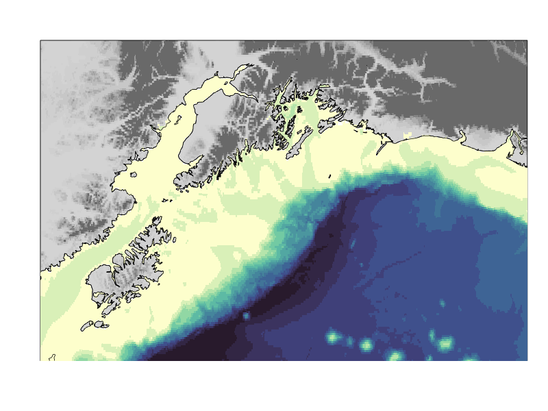

# SimpleBathy

An add on package for [SimpleMapper](https://github.com/tbrycekelly/SimpleMapper) to provide bathymetric data and capabilities.

You may also be interested in a color palette package available based on the excellent _batlow_ set of palettes for scientific data presentation: [batlow package](https://github.com/tbrycekelly/batlow).

## Getting Started

The easiest way to install the package (until I get around to adding this to CRAN) is via *devtools*.

If you don't have *devtools*, then install that first via CRAN:

``` r
install.pacakges('devtools')
```

Now you can use *devtools* to install R packages from Github, such as *SimpleMapper*:

``` r
devtools::install_github('tbrycekelly/SimpleMapper') # If you don't have it already.
devtools::install_github('tbrycekelly/SimpleBathy')
```

All done! Now *SimpleBathy* can be loaded just like any other package: `library(SimpleBathy)`.

------------------------------------------------------------------------

#### Examples



```r
map = plotBasemap(coastline4, scale = 500, lat = 60, lon = -147)
map = addBathy(map, zlim = c(-3e3, 0), ztrim = c(-3e3, NA), pal = pals::cubicl(128))
map = addRelief(map)
map = addCoastline(map)
map = addLatitude(map)
map = addLongitude(map)
```

------------------------------------------------------------------------



```r
map = plotBasemap(coastline4, scale = 1000, lat = 60, lon = -147)
map = addBathy(map, zlim = c(-3e3, 0), ztrim = c(-3e3, NA), pal = rev(pals::brewer.blues(32)))
map = addCoastline(map)
```

------------------------------------------------------------------------



```r
map = plotBasemap(coastline3, scale = 2000, lat = 60, lon = -147)
map = addBathy(map, zlim = c(-3e3, 0), ztrim = c(-3e3, NA), pal = greyscale(8))
map = addRelief(map)
map = addCoastline(map)
```

------------------------------------------------------------------------



```r
map = plotBasemap(coastline3, scale = 8000, lat = 90, lon = 0)
map = addBathy(map, zlim = c(-3e3, 0), ztrim = c(-3e3, NA), pal = pals::cubicl(8))
map = addRelief(map, zlim = c(100, 1000))
map = addCoastline(map)
```

------------------------------------------------------------------------



```r
map = plotBasemap(coastline4, scale = 500, lat = 59, lon = -148)
map = addBathy(map, zlim = c(-5e3, 0), ztrim = c(-5e3, NA), pal = pals::ocean.deep(16), trim = F)
map = addRelief(map, zlim = c(100, 1000))
map = addCoastline(map)
```

------------------------------------------------------------------------

## About
